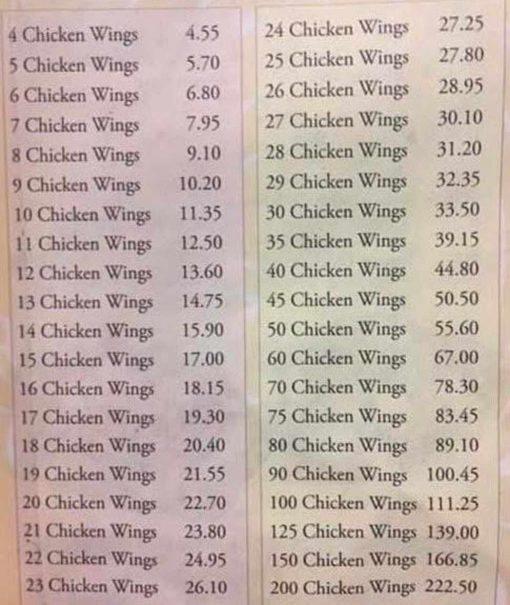
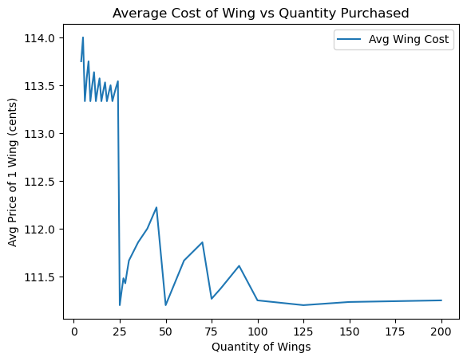

# Chicken Wing Optimisation

## Introduction
I came across this image of one of the menus of all time. I just had to know what was the optimal number of chicken wings to purchase, and by extension, if there was a way to minimise the number of orders and the overall cost of those orders.

## The Menu

 

Absolutely glorious. Each quantity and price was compiled into an [excel sheet](data/Chicken_Wings.xlsx) for some initial analysis. A simple scatter graph was also plotted detailing the how the average wing cost varies with the quantity of wings purchased.

## Initial Findings

 

After using matplotlib to plot the graph, it is clear that there is some method to this madness. The average price of a wing seems to drop drastically for 25, 50, and 125 wings. 

Ultimately,
- The  best  deal on wings is for 111.2 cents per wing (25, 50, or 125 wings).
- Conversely, the  worst  deal on wings is for 114.0 cents per wing (5 wings).

