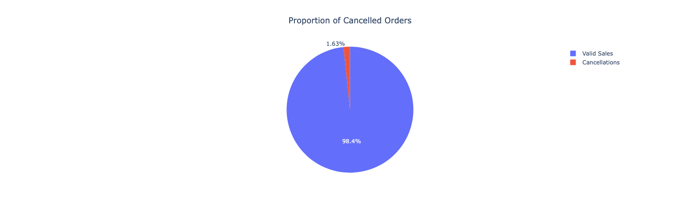

# Online Retail Analysis

## Introduction
This is a transactional dataset which contains all the transactions occurring between 01/12/2010 and 09/12/2011 for a UK-based and registered non-store online retail.

The dataset was retrieved from [UCI's Machine Learning Repository](https://archive.ics.uci.edu/dataset/352/online+retail).

## Dataset Features
The dataset contains 541,909 rows of transactional information.

<table>
  <thead>
    <tr>
      <th>Attribute</th>
      <th>Description</th>
      <th>Type</th>
      <th>Example(s)</th>
      <th>Comment(s)</th>
    </tr>
  </thead>
  <tbody>
    <tr>
      <td><strong>InvoiceNo</strong></td>
      <td>6-digit unique identifier for each invoice. Prefix 'C' indicates cancellation</td>
      <td>Categorical</td>
      <td>536365   C536383 </td>
      <td></td>
    </tr>
    <tr>
      <td><strong>StockCode</strong></td>
      <td>5-digit identifier unique for each product.</td>
      <td>Categorical</td>
      <td>85123A</td>
      <td></td>
    </tr>
    <tr>
      <td><strong>Description</strong></td>
      <td>Product Name.</td>
      <td>Categorical</td>
      <td>WHITE HANGING HEART T-LIGHT HOLDER</td>
      <td></td>
    </tr>
    <tr>
      <td><strong>Quantity</strong></td>
      <td>Number of products purchased.</td>
      <td>Integer</td>
      <td>5</td>
      <td>Negative for cancellations</td>
    </tr>
    <tr>
      <td><strong>InvoiceDate</strong></td>
      <td>Date and time of transaction generation (D/MM/YY)</td>
      <td>Date (DD/MM/YY HH:MM)</td>
      <td>1/12/10 8:26</td>
      <td>Converted to datetime format (YYYY-MM-DD)</td>
    </tr>
    <tr>
      <td><strong>UnitPrice</strong></td>
      <td>Price (in Sterling) per unit of the product.</td>
      <td>Continous</td>
      <td>55</td>
      <td></td>
    </tr>
    <tr>
      <td><strong>CustomerID</strong></td>
      <td>Unique 5-digit identifier for the customer.</td>
      <td>Categorical</td>
      <td>12345</td>
      <td></td>
    </tr>
    <tr>
      <td><strong>Country</strong></td>
      <td>Country where the customer resides.</td>
      <td>Categorical</td>
      <td>United Kingdom</td>
      <td></td>
    </tr>
  </tbody>
</table>

## Data Cleaning & Preparation
### 1. Check for NA values
<table>
  <thead>
    <tr>
      <th>Column Name</th>
      <th>Null Count</th>
      <th>Removed?</th>
    </tr>
  </thead>
  <tbody>
    <tr>
      <td><strong>Description</strong></td>
      <td>1,454</td>
      <td>Yes</td>
    </tr>
    <tr>
      <td><strong>CustomerID</strong></td>
      <td>135,080</td>
      <td>No</td>
    </tr>
</table>

540,455 rows left after dropping 1,454 NA values (based on 'description' column)

### 2. Split Dataset into valid_sales & cancellations
- valid_sales (531167 rows)
- cancellations (9288 rows)

### 3. Clean valid_sales
<table>
  <thead>
    <tr>
      <th>Sanity Check</th>
      <th>Rows Removed</th>
    </tr>
  </thead>
  <tbody>
    <tr>
      <td><strong>Invalid Quantity</strong></td>
      <td>474</td>
    </tr>
    <tr>
      <td><strong>Invalid StockCode  e.g. POST, M etc.</strong></td>
      <td>2,312</td>
    </tr>
    <tr>
      <td><strong> Invalid Price</strong></td>
      <td>578</td>
    </tr>
</table>

527,803 rows left in valid_sales

### 4. Clean cancellations
<table>
  <thead>
    <tr>
      <th>Sanity Check</th>
      <th>Rows Removed</th>
    </tr>
  </thead>
  <tbody>
    <tr>
      <td><strong>Negative Quantities</strong></td>
      <td>0   (Converted all to positive) </td>
    </tr>
    <tr>
      <td><strong>Invalid StockCode  e.g. POST, M etc.</strong></td>
      <td>527</td>
    </tr>
    <tr>
      <td><strong> Invalid Price</strong></td>
      <td>0</td>
    </tr>
</table>

8,761 rows left in cancellations

## General Analysis
### Proportion of items returned

1.63% (8,761) of all the orders were cancelled.

## Analysis of Valid Sales
### Total Revenue by Month

Highest revenue was in November 2011 (£1,457,297.07)

Lowest revenue was in February 2011 (£508,778.24)

Average revenue was £790,974.00 per month

### Total Revenue by Country (Top 10)

There are 446 items not associated with any country

The United Kingdom generated the most revenue (£8,759,341.53) based on this graph. However, this is expected because the company is based in the UK, and they sold the most items in the UK (4,654,401 items from 17914 invoices). 

### Top Average Order Values (Top 10)
Another metric of sales is the average order value (AOV), or average revenue per invoice. This helps identify which country had higher value transactions

AOV = Total Revenue / Number of Invoices

For example, sales in the Netherlands generated £283,794.69 from selling 200,258 items from 93 invoices. This indicates the AOV in the Netherlands is much higher than in the UK (£3051.56 vs £488.97)

It is clear that the Netherlands either makes more bulk purchases, or purchases more higher-value items per wholesale